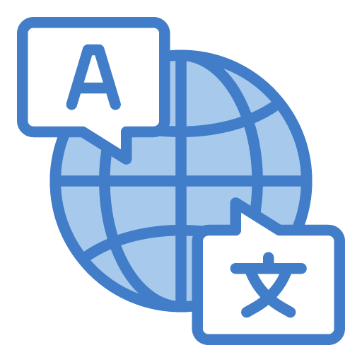

# Rosetta Crowd
> Prototipo di traduzione crowd-sourced per progetti opensource sviluppato dagli studenti dell'I.I.S. "Casagrande-Cesi" di Terni

## Indice

- [Introduzione](#introduzione)
- [Tecnologia](#tecnologia)
- [Licenza](#licenza)

## Introduzione

L'idea alla base di Rosetta Crowd è quella di fornire a chiunque la possibilità di supportare i progetti opensource promuovendone allo stesso tempo la diffusione presso il publico non tecnico. L'app consente di inviare delle traduzioni preventivamente richieste dagli sviluppatori: gli utenti dell'app, dopo aver scelto la propria lingua madre ed una seconda lingua conosciuta, potranno cimentarsi nella traduzione di parole e brevi frasi. Allo stesso tempo gli utenti potranno scoprire i più svariati progetti opensource ad approfondire (e magari scaricare!) quelli più interessanti.

L'app è stata sviluppata dalla classe IV A (A.S. 2022/23) dell'I.I.S. "Casagrande-Cesi" di Terni nell'ambito del concorso "Libertà e solidarietà nella società digitale" indetto da "Programma il futuro" nel 2023.

## Tecnologia

Rosetta Crowd è stata sviluppata in ambiente [App Lab](https://code.org/educate/applab). Successivamente è stata esportata come codice HTML, CSS e JavaScript ed inserita all'interno di un progetto [Apache Cordova](https://cordova.apache.org/) per poter essere compilata per Android ed iOS.

## Licenza

Rosetta Crowd è rilasciata secondo i termini della licenza MIT.